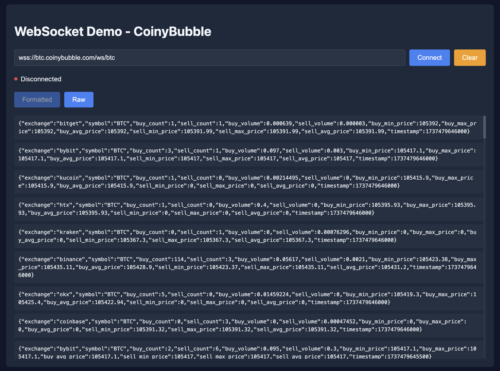

# WebSocket Demo - CoinyBubble

A simple, single-file demonstration of real-time Bitcoin trading data using WebSocket connection. This demo allows connecting to the CoinyBubble free WebSocket stream and viewing live trading data in both raw and formatted views.



## Features

- Direct WebSocket connection without authentication
- Real-time trading data from major exchanges
- Two display modes: Raw and Formatted JSON
- Automatic trade history with last 100 trades
- Connection status indicator
- No installation required - works out of the box

## Quick Start

1. Download `index.html`
2. Open it in any modern browser
3. Click "Connect" (default WebSocket URL is pre-filled)
4. Watch real-time trading data

## WebSocket Data Format

Each message represents a trading snapshot from an exchange:

```json
{
  "exchange": "binance",
  "symbol": "BTC",
  "buy_count": 7,
  "sell_count": 2,
  "buy_volume": 0.01271,
  "sell_volume": 0.00122,
  "buy_min_price": 104859.92,
  "buy_max_price": 104859.92,
  "buy_avg_price": 104859.92,
  "sell_min_price": 104859.91,
  "sell_max_price": 104859.91,
  "sell_avg_price": 104859.91,
  "timestamp": 1737257803000
}
```

### Message Fields

| Field | Type | Description |
|-------|------|-------------|
| exchange | string | Exchange identifier (e.g., "binance", "coinbase") |
| symbol | string | Trading pair symbol (currently "BTC") |
| buy_count | number | Number of buy trades in this snapshot |
| sell_count | number | Number of sell trades in this snapshot |
| buy_volume | number | Total volume of buy trades in BTC |
| sell_volume | number | Total volume of sell trades in BTC |
| buy_min_price | number | Lowest buy price in USD (0 if no buys) |
| buy_max_price | number | Highest buy price in USD (0 if no buys) |
| buy_avg_price | number | Volume-weighted average buy price (0 if no buys) |
| sell_min_price | number | Lowest sell price in USD (0 if no sells) |
| sell_max_price | number | Highest sell price in USD (0 if no sells) |
| sell_avg_price | number | Volume-weighted average sell price (0 if no sells) |
| timestamp | number | Unix timestamp in milliseconds |

## WebSocket URL

```
wss://btc.coinybubble.com/ws/btc
```

## Technical Details

- Built with Vue.js 3 (loaded from CDN)
- Pure HTML/CSS/JavaScript
- No build tools or installation required
- No backend dependencies
- WebSocket native browser API

## Browser Support

Works in all modern browsers that support WebSocket:
- Chrome
- Firefox
- Safari
- Edge

## Development

Want to modify the demo? The entire application is in a single HTML file:
- Vue.js application logic is in the script section
- Styles are in the style section
- HTML template is in the body

## License

MIT License - feel free to use this demo for any purpose.

---

Made with ❤️ by [CoinyBubble](https://coinybubble.com)